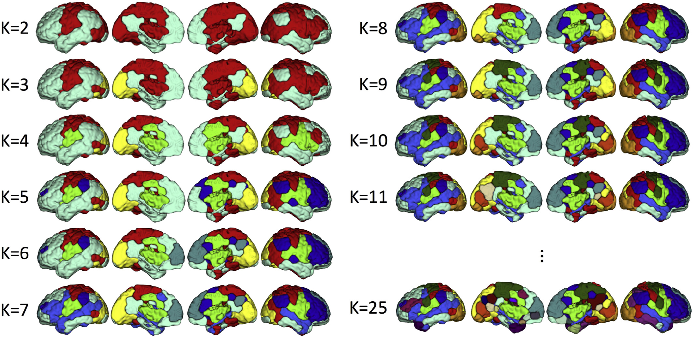

# NetworkParcellation

<p align="center">
	
</p>

These set of functions are used to generate the anlaysis in Salehi et al. [1]. This paper uses data from two resting-state sessions (REST1 and REST2) of the Human Connectome Project (HCP) S900 release [2]. This repository includes MATLAB functions to:

1) Import HCP data into MATLAB's workspace: **import_HCP_data.m**
2) Generate individualized resting-state parcellations: **parcellation_rest.m**
3) Compute and compare internal clustering quality measures such as Dunn index and Davies-Bouldin index (DB): **comparison_db_dunn.m**
4) Compute the reproducibility of tha parcellations between different sessions of resting-state: **rest1_rest2_reproducibility.m**
5) Develop predictive models based on node-to-network assignment (NNA) vectors using gradient boosting machines (GBM): **exemplar_based_predictive_analysis.m**
6) Compute the importance of features (here nodes) in the predictive model's performance: **feature_importance_analysis.m**


The main function in this set is **"parcellation_rest.m"**, which generates the individualzied functional networks from the node-level (i.e., parcellated by grouping voxels into nodes) fMRI data. You can execute this function via the following:

1. Using the link on the top right corner of this page, clone this repository to your local computer using the following command: 
```bash
git clone https://github.com/YaleMRRC/Network-Parcellation-Rest.git
``` 
2. In MATLAB add the path to your script or in your workspace: 
```matlab
addpath('localpath/Network-Parcellation-Rest/')
```
3. Load in HCP resting-state data from your local directory (datadir) by running the following function:
```matlab
[M, HCP_subj] = import_HCP_data(datadir)
```
4. Run the following: 
```matlab
[S_opt_all, index_global, Maj, F = parcellation_rest(M,HCP_subj,label_134_cort,K_max)
```
* Inputs: 
  * **label_134_cort** is a vector indicating whether each node belongs to cortex, subcortex, or cerebellum. This is used to automatically include/exclude specific parts of the brain from the analysis.
  * **K_max** indicates the number of networks. 
* Outputs:
  * **S_opt_all** is the set of identified exemplars.
  * **index_global** consists of the individualized parcellation vectors where every element represents the network number that each node is assigned to.
  * **Maj** is the group parcellation vector computed by taking the relative majority voting.
  * **F** represents the number of votes for the group assignments.

The rest of the functions are either auxiliary functions that are called by the meain function, or are used for other analyses in the paper.


For further questions please raise an issue [here](https://github.com/YaleMRRC/Network-Parcellation-Rest/issues).


### References

[1] Salehi, M., Karbasi, A., Shen, X., Scheinost, D., & Constable, R. T. (2018). An exemplar-based approach to individualized parcellation reveals the need for sex specific functional networks. NeuroImage, 170, 54-67.

[2] Van Essen, D. C., Smith, S. M., Barch, D. M., Behrens, T. E., Yacoub, E., Ugurbil, K., & Wu-Minn HCP Consortium. (2013). The WU-Minn human connectome project: an overview. Neuroimage, 80, 62-79.
